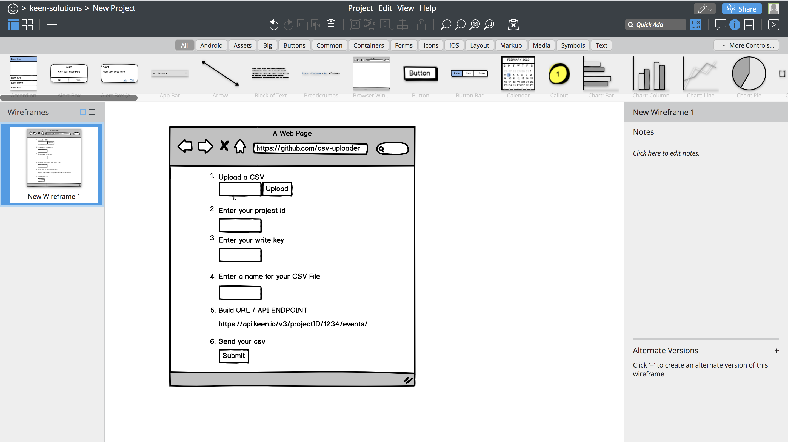

csv-uploader user interface

The following solution is to provide all enduser a simple way of uploading a CSV.
The process is still heavy for those users looking to evaluate Keen in a trial basis or to users that would like to upload smaller collections of batch streams.

This will be a UI abstraction to CLI process.
https://github.com/keen/keen-cli

POST Example via Curl Request
curl https://api.keen.io/3.0/projects/PROJECT_ID/events/COLLECTION_NAME \
 -H "Authorization: WRITE_KEY" \
 -H 'Content-Type: application/json' \
 -d '{
    "key": 123
    }'

GET Request via Curl

curl "https://api.keen.io/3.0/projects/PROJECT_ID/events/COLLECTION_NAME?api_key=WRITE_KEY&data=ENCODED_DATA"

Successful Response
{
"created": true
}

__

Objective: Create a CSV Uploader to POST the files’ data to the designated Keen Project endpoint

Steps to achieve

Create an API that can handle a Post Request to Keen API project endpoints

This api should Upload a CSV file  

Logic that converts this CSV file into a Json format  

An end user will insert their project id to the form field input  

An end user will insert their write key to the form field input  

An end user will insert the name of the collection to the form field input  

A URL will appear on load and will the dynamic render the field inputs  

A submit button will run a POST Request to the dynamic URL  

This page will respond with a success or failure message  

If it’s successful this page will render a 200 Message "success": true  

If it’s a failure this page will render the code with some diagnosis such as having hit the streaming limitations or a file size exceeding 400k limits (100k rows of data) etc  

What a successful output it will look like:  
https://jac-keen.github.io/csv-uploader/
